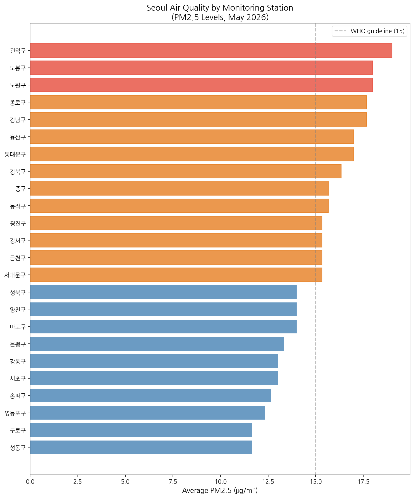

# AWS Data Pipeline - Seoul Air Quality 🌫️

An automated serverless data pipeline that collects, processes, 
and analyzes real-time air quality data across Seoul districts.

## Architecture
```
EventBridge (hourly)
      ↓
AWS Lambda (Python)
      ↓
Amazon S3 (data lake)
      ↓
AWS Glue (schema catalog)
      ↓
Amazon Athena (SQL analytics)
```

## AWS Services Used
| Service | Purpose |
|---|---|
| AWS Lambda | Serverless hourly data collection (Python) |
| Amazon S3 | Data lake storage (raw + processed layers) |
| Amazon EventBridge | Hourly scheduling & automation |
| AWS Glue | Schema cataloging |
| Amazon Athena | SQL-based analytics & insights |

## Key Findings
- Analyzed PM2.5 and PM10 levels across 25 districts in Seoul
- 강남구 recorded the highest average PM2.5 (19.5 μg/m³)
- All districts exceeded WHO PM2.5 guideline of 15 μg/m³
- Pipeline runs automatically every hour, 24/7

## Pipeline Flow
1. EventBridge triggers Lambda every hour automatically
2. Lambda calls Korea Public Air Quality API (에어코리아)
3. Data saved as newline-delimited JSON to S3
4. Athena queries data to generate district-level insights
5. Results saved as Parquet files for efficient querying

## Visualizations


## Skills
`Python` `AWS Lambda` `Amazon S3` `Amazon Athena` 
`AWS Glue` `Amazon EventBridge` `SQL` `ETL` `Data Lake`
